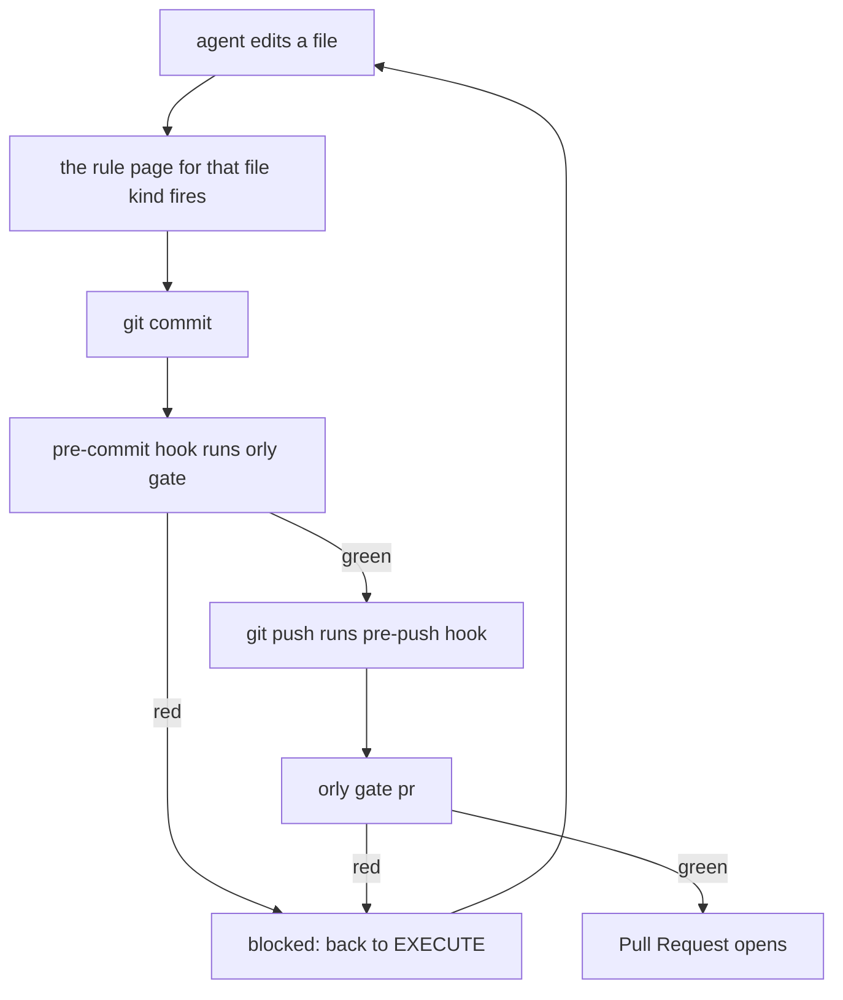
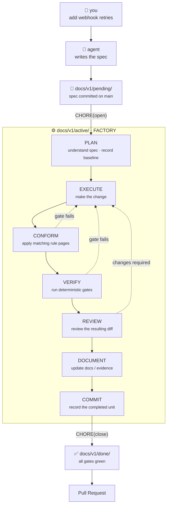

<div align="center">


# orly

[](https://www.npmjs.com/package/@agentsfleet/orly)
[](https://bun.sh)
[](https://codecov.io/gh/agentsfleet/orly)
[](https://opensource.org/licenses/MIT)

[](https://platform.claude.com/docs/en/claude-code)
[](https://github.com/openai/codex)
[](https://opencode.ai)
[](https://ampcode.com)

**AI-native development, made deterministic. Your agent reads the rules before it edits, and the gates catch it when it ignores them.**

</div>

> [!NOTE]
> **Are you an agent?** Read [`llms.txt`](llms.txt) instead of this page.
>
> It carries the same setup written for machines: exact commands, exact paths, and a decision table for every failure. Humans should carry on here.

---

## Why orly exists

Your agent reads your conventions. Then it writes whatever it likes. Nothing checks.

orly ships both halves of the fix:

- **Rules** — the agent reads them before it edits.
- **Gates** — scripts wired into git hooks that fail the commit when a rule was ignored.

The rules were derived from gstack and gbrain, then hardened over 500+ merged pull requests shipping [agentsfleet](https://github.com/agentsfleet/agentsfleet).

Where you disagree, your own `AGENTS.md` wins.

Works with Claude Code, Codex, OpenCode, and Amp.

---

## Prerequisites

| You need | Why | Version |
|---|---|---|
| [bun](https://bun.sh) | runs orly; `bunx` fetches it | ≥ 1.4.0 |
| git | orly writes the hooks; `orly gate` reads the branch | any |
| a coding agent | something has to read the rules | Claude Code, Codex, OpenCode, or Amp |
| your own check commands | `orly gate` runs whatever `.oracle/orly.json` names | whatever your repository already runs |

> [!IMPORTANT]
> git never clones hooks. Every teammate runs `orly init` once in their own checkout, even after the rules are committed.

---

## Install

Run this inside the repository you want governed.

```bash
bunx @agentsfleet/orly init
```

orly scans your source, detects your languages, and installs only the rules that apply.

> [!TIP]
> Try `bunx @agentsfleet/orly init --dry-run` first. It prints everything it would write and changes nothing.

Then commit what it wrote. Teammates get the rules on clone.

---

## What lands in your repository

```text
your-repo/
│
├── AGENTS.md ─────────────── yours. untouched, except one delimited pointer block
├── AGENTS.orly.md ────────── the generated rules: safety, dispatch router, lifecycle
│
├── dispatch/*.md ─────────── one rule page per kind of work
├── audits/*.sh ───────────── the deterministic gates
├── docs/*.md ─────────────── the standards those rules cite
│
├── .claude/skills/ ───────── the same skills, materialised per agent host
├── .agents/skills/
├── .opencode/skills/
│
├── .githooks/ ────────────── pre-commit and pre-push, wired to `orly gate`
└── .oracle/orly.json ─────── which packs, which commands, what orly installed
```

`orly init` also seeds `.oracle/orly.json` with any gate commands it finds in your `Makefile` or `package.json`. Fill in the rest, commit it, and every clone gates identically.

---

## What happens on every commit



Three checkpoints, all running your own declared commands:

| Checkpoint | When | Effect |
|---|---|---|
| `pre-commit` | every commit | stops at the first failing check |
| `pre-push` | every push | same gates, before anything leaves the machine |
| `orly gate pr` | opening the Pull Request | refuses until each criterion is green, or carries a recorded override |

---

## The loop you live in

`orly init` is the setup. This is one task, from prompt to Pull Request.

The spec is a file on disk, and **its directory is the status**. Only the stages named in the rules move it.



| Directory | Meaning |
|---|---|
| `docs/v1/pending/` | the spec is written and committed on `main` |
| `docs/v1/active/` | branch cut, baseline recorded, no code until it commits |
| `docs/v1/done/` | gates green, Pull Request opens |

Inside `active/`, orly runs the **factory**: **PLAN → EXECUTE → CONFORM → VERIFY → REVIEW → DOCUMENT → COMMIT**.

The factory is not another status. `active/` is the status. The factory is the controlled loop that runs on the active spec.

Three things do three different jobs, and keeping them apart is what makes the lifecycle mechanical:

| | Job |
|---|---|
| **Directories** | lifecycle state — where the spec sits |
| **Factory** | execution machinery — what moves the work |
| **Gates** | transition authority — whether it may advance |

Each edit activates the rule page for that file kind. A gate proves whether the work may advance, and any red returns the agent to EXECUTE. No stage can be skipped quietly.

## Your files stay yours

| File | Owner | On `orly update` |
|---|---|---|
| `AGENTS.md` | **you** | untouched, except one delimited pointer block |
| `AGENTS.orly.md` | orly | rewritten |

Every agent runtime auto-loads `AGENTS.md`, so it stays yours. orly writes its rules beside it and adds a pointer so they get read.

> [!WARNING]
> orly refuses to replace a hook or rule page it did not write. `--force` and `--no-hooks` are the ways through. A refused run changes nothing.

---

## Commands

| Command | Does |
|---|---|
| `orly init` | write the rules, gates, skills, and hooks |
| `orly init --dry-run` | show what would be written; change nothing |
| `orly update` | re-materialise at a newer engine version |
| `orly update --with <pack>` | add an opt-in pack, recorded for every clone |
| `orly gate` | run your declared checks in order, stopping at the first failure |
| `orly override <criterion> --reason <why>` | record a gate exception as an empty commit that rides into the Pull Request |
| `orly doctor` | compare what is installed against what orly would write today |

---

## Which packs you get

### Chosen by your source

orly scans four directories deep. It skips `node_modules`, `target`, `.venv`, and the other dependency trees, so one stray file cannot select a language you do not write.

| Pack | Selected when your source has |
|---|---|
|  `language.zig` | `.zig` |
|  `language.typescript` | `.ts`, `.tsx` |
|  `language.javascript` | `.js`, `.jsx` |
|  `language.rust` | `.rs` |
|  `language.go` | `.go` |
|  `language.python` | `.py` |
|  `language.shell` | `.sh` |
|  `language.mdx` | `.mdx` |
|  `domain.sql` | `.sql` |

### Installed everywhere

| Pack | What it carries |
|---|---|
| `universal.authoring` | file length, logging, named constants, no dead code, the lifecycle runbook |
| `domain.http` | REST API design rules |
| `domain.auth` | auth-flow invariants |
| `domain.documentation` | `DOCUMENTATION_RULES.md`, the voice standard for published pages |
| `domain.changelog` | changelog voice, and what never gets rewritten |
| `workflow.specifications` | the spec template and the gate that checks its shape |
| `workflow.skills` | four skills, written once for all four agents |

### Opt-in, only when `.oracle/orly.json` names them

| Pack | What it adds | Why it is opt-in |
|---|---|---|
| 🦉 `workflow.governance` | the rules for editing rules, their questionnaire, and orly's architecture | only useful if you edit orly itself |
| `product.agentsfleet` | three audit scripts, the verify dispatch page, four `agentsfleet` docs | a product surface that means nothing in another checkout |
| 🤠 `persona.indy` | no files; it rewrites the address handles and tone in the generated rules | one maintainer's name and voice |

---

## gstack is optional

orly does not require [gstack](https://github.com/garrytan/gstack) to install or run.

| gstack installed? | What happens at the review stage |
|---|---|
| yes | `/review` is detected and runs automatically |
| no | orly records the skipped review in the Pull Request notes, to be rerun before merge |

If you do want it:

```bash
cd ~/.local/share/gstack && ./setup --host auto
```

`--host auto` covers every agent host gstack finds. Name one to target it alone: `claude`, `codex`, `kiro`, `factory`, `opencode`, `openclaw`, `hermes`, `gbrain`, or `auto`.

> [!NOTE]
> The four governance skills (`orly-spec-new`, `orly-babysit-prs`, `orly-write-unit-test`, `orly-write-integration-test`) come from orly's `workflow.skills` pack, per repository. The general-purpose skills come from gstack, per agent host. orly neither installs nor manages gstack.

---

## Local development

For working on orly itself. Pull requests are welcome.

### Prerequisites

| You need | Version |
|---|---|
| bun | ≥ 1.4.0 |
| git | any |
| make | any |

### Set up

```bash
git clone git@github.com:agentsfleet/orly.git && cd orly
git config core.hooksPath .githooks
bun install --frozen-lockfile
make audit
```

### The bar

`make audit` is the bar. If it passes, the change is reviewable. Its steps run in parallel, around half a minute:

- **typecheck and unit tests**
- **render determinism** — the same sources always produce the same rules
- **gate fixtures** — every gate proved against one passing and one failing case

Coverage is gated at a 90% line floor. The workflow fails below it.

### Install evals

Real installs into throwaway repositories. They cost about twice the local chain's wall-clock, so they run on demand:

```bash
make install-evals
```

CI runs them on every pull request and release.

### Rendering orly's own rules

orly governs itself with the same verb everyone else uses:

```bash
bin/orly update --no-hooks
```

`--no-hooks` because this checkout hand-wrote its `.githooks/`, and orly refuses to replace hooks it did not write.

### Releasing

Merge to `main` with a new `package.json` version. That publishes it, tags it, and cuts a GitHub release. There is no second command to remember.

---

## Try it

Run this in a repository you own. It writes nothing until you drop the flag.

```bash
bunx @agentsfleet/orly init --dry-run
```

It prints the rules it would install, already rendered for the languages it found in your source. Read them. If you disagree with one, that is the point: your own `AGENTS.md` overrides it.

Then hand your agent the prompt orly was built for:

```text
Read AGENTS.orly.md. Tell me which of my last ten commits would have tripped a
gate, and name the rule that caught each one.
```

---

## License

[MIT](LICENSE)

<div align="center">

[](https://github.com/agentsfleet/agentsfleet)

Made by 🤠 [Indy](https://github.com/indykish) · written with 🦉 Orly

</div>
