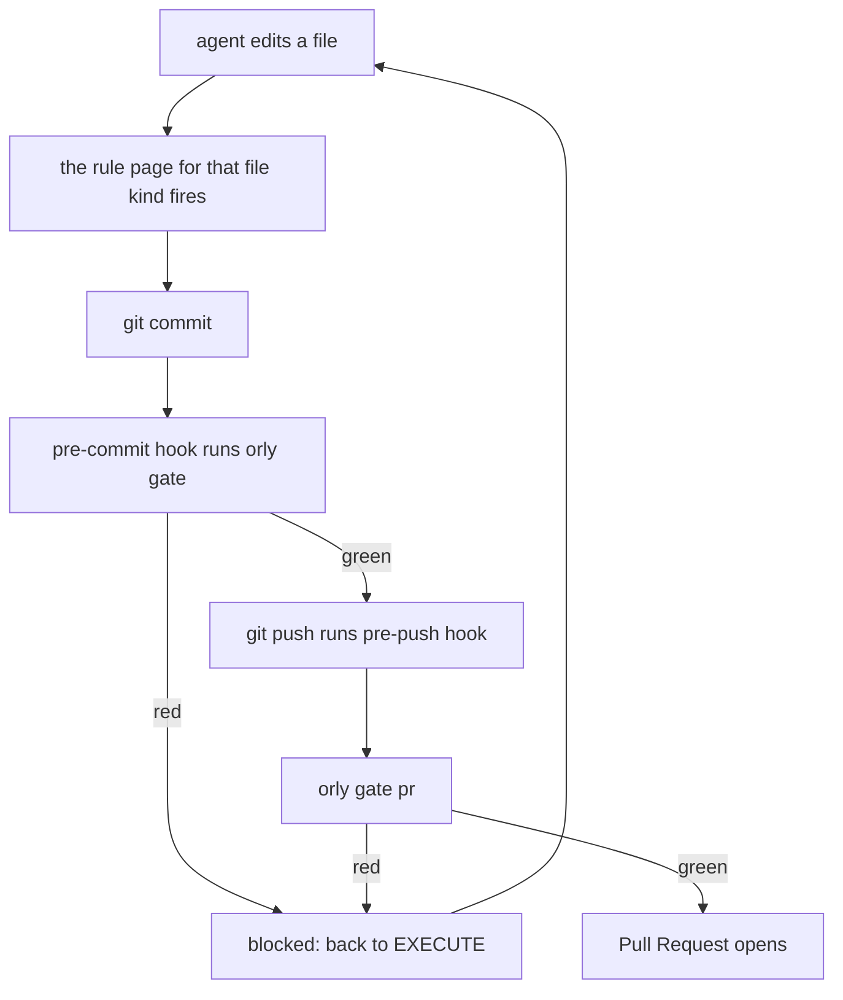
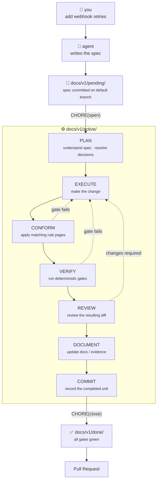

<div align="center">


# orly

[](https://www.npmjs.com/package/@agentsfleet/orly)
[](https://bun.sh)
[](https://codecov.io/gh/agentsfleet/orly)
[](https://opensource.org/licenses/MIT)

[](https://platform.claude.com/docs/en/claude-code)
[](https://github.com/openai/codex)
[](https://opencode.ai)
[](https://ampcode.com)

**AI-native development, made deterministic. Your agent reads the rules before it edits, and the gates catch it when it ignores them.**

</div>

> [!NOTE]
> **Are you an agent?** Read [`llms.txt`](llms.txt) instead of this page.
>
> It carries the same setup written for machines: exact commands, exact paths, and a decision table for every failure. Humans should carry on here.

---

## Why orly exists

Your agent reads your conventions. Then it writes whatever it likes. Nothing checks.

orly ships both halves of the fix:

- **Rules** — the agent reads them before it edits.
- **Gates** — scripts wired into git hooks that fail the commit when a rule was ignored.

The rules were derived from gstack and gbrain, then hardened over 500+ merged pull requests shipping [agentsfleet](https://github.com/agentsfleet/agentsfleet).

Where you disagree, your own `AGENTS.md` wins.

Works with Claude Code, Codex, OpenCode, and Amp.

---

## 0.14: retained Jev answers explained

The [offline diagnosis](https://github.com/agentsfleet/orly/blob/main/evals/judgments/comparison/diagnosis/report.md) explains all 188 retained TypeSafe Jev attempts.
It separates native-answer agreement, confidence withholding, grading disagreements and unavailable replies.
Each attempt links to its saved inputs and a bounded explanation; unknown provider causes stay unknown.

The diagnosis uses existing receipts and sends no new provider requests.
All five proposed checks remain evaluation-only while fixture meanings and independent adoption evidence need review.
These contributor records live in the source checkout; installed packages link to the same published source.

## Measured judgment comparison

The source-checkout examiner checks unsupported completion claims.
It freezes the six runtime questions and evaluates five proposed checks separately.
Those checks cover obligations, evidence, production wiring, failure tests and finding resolution.

From a source checkout, run `bun evals/judgments/comparison/run.ts --check` to validate the frozen inputs.
Expected output is JSON with six baseline questions, five candidates and `passed: true`.
Run `bun evals/judgments/comparison/run.ts --offline` for whole-task exercises with hidden behavioral checks.
A successful run reports `passed: true`; seeded false completions remain failed task outcomes.

A separate explicit `jev-run.ts --live` command measures TypeSafe Jev answers against the frozen expectations.
Its retained report lists every measured answer, grading match, disagreement and unavailable response.
The saved replay reproduced every result with zero new requests at historical source revision [`751ee303`](https://github.com/agentsfleet/orly/tree/751ee303d0c97a403863f12f33adf8fbc20ff433).
Replay requires that revision's unchanged source inventory; changed bytes fail admission.
Autonomous agent improvement remains unmeasured.
All five candidates remain evaluation-only; uncertain and failed replies stay in the report.
An additional rehearsal uses the packed candidate and actual `agentsfleet` source in an isolated worktree.
See the [evaluation design](docs/architecture/judgment-evaluation.md) for commands, evidence and limits.

The `.orly/` layout, six runtime questions and 0.12.1 audit and check-diagnostic fixes remain unchanged.
The [0.12 report](evals/release/release-report.md) retains the earlier package and consumer migration evidence.
TypeSafe's Jev model supplies runtime advice through explicit `orly judge` requests; contributor measurement uses the separate live evaluator.

See [releases](https://github.com/agentsfleet/orly/releases) for published versions.
The install commands below fetch the published package.
The release workflow publishes 0.14.0 after its version change merges to `main`.

---

## Prerequisites

| You need | Why | Version |
|---|---|---|
| [bun](https://bun.sh) | runs orly; `bunx` fetches it | ≥ 1.4.0 |
| git | orly writes the hooks; `orly gate` reads the branch | any |
| a coding agent | something has to read the rules | Claude Code, Codex, OpenCode, or Amp |
| your own check commands | `orly gate` runs whatever `.orly/orly.json` names | whatever your repository already runs |

> [!IMPORTANT]
> git never clones hooks. Every teammate runs `orly init` once in their own checkout, even after the rules are committed.

---

## Install the published package

Run this inside the repository you want governed.

```bash
bunx --bun @agentsfleet/orly init
```

orly scans your source, detects your languages, and installs only the rules that apply.

> [!TIP]
> Try `bunx --bun @agentsfleet/orly init --dry-run` first. It previews the generated rules and changes nothing.

Complete any setup items printed by `init`, then run `bunx --bun @agentsfleet/orly doctor` and commit the generated files.
Use `bunx --bun @agentsfleet/orly <COMMAND>` for the commands below; `<COMMAND>` names the command and its options.
Generated Git hooks invoke the pinned package through `bunx`; Bun must be on the hook search path. No global orly installation or project dependency is required.

Teammates get the rules on clone and run `orly init` to install their hooks.

Declare `conform` and at least one `verify.*` command in `.orly/orly.json`.
Orly runs your repository's commands; the verification name does not require a particular language or test runner.
For a documentation repository whose Makefile provides `test` and `lint`:

```json
"commands": {
  "conform": [["make", "test"]],
  "verify.docs": [["make", "lint"]]
}
```

Here `test` checks documentation during work, and `lint` validates the site and links before the pull request.
Markdown and Markdown JSX (MDX) repositories do not need application unit or integration suites.
`orly doctor` checks configuration and installed files; run the gates to verify the commands themselves.

Each invocation has a 30-minute deadline and a 64-mebibyte combined output budget.
Exceeding either limit fails the check, stops its child processes and prints a private output receipt path.
Set per-command overrides in `.orly/orly.json`, for example:

```json
"limits": {
  "verify.unit": { "timeout_ms": 1800000, "output_bytes": 67108864 }
}
```

The receipt retains all captured output until you remove its printed directory.
Unknown settings and malformed values are refused; `schemas/profile.schema.json` describes the repository configuration.

---

## Upgrade from 0.10.x

Run the update from the consumer repository. If the repository owns its hooks, preserve them explicitly:

```bash
bunx --bun @agentsfleet/orly update --no-hooks
```

Expected: managed files move under `.orly/`; owner hooks remain unchanged. Conflicting owner edits stop the update and name the affected path.
Use the installed candidate executable for an unpublished release trial; the command above fetches the published version.

Update repository-owned callers that still read `.oracle/orly.json`, root `dispatch/`, or managed root audit paths.
Their replacements are `.orly/orly.json`, `.orly/dispatch/`, and `.orly/audits/`.
Repository-owned audit scripts and project documents retain their existing locations.
Review existing hooks before choosing an update without `--no-hooks`.

```bash
bunx --bun @agentsfleet/orly doctor
```

Expected: installed rules match `.orly/orly.json` and work and verification commands are declared.
Then run the repository's declared checks; `doctor` alone does not run them.
An empty old directory can remain after its files move. Git does not track empty directories; remove one only after checking it is empty.

---

## What lands in your repository

```text
your-repo/
│
├── AGENTS.md ─────────────── yours. untouched, except one delimited pointer block
├── .orly/AGENTS.md ────────── the generated rules: safety, dispatch router, lifecycle
│
├── CLAUDE.md ─────────────── one import line; the only file Claude Code loads itself
├── opencode.json ─────────── names both rule files; opencode loads nothing by default
│
├── .orly/dispatch/*.md ───── one rule page per kind of work
├── .orly/audits/ ─────────── the deterministic gates
├── .orly/docs/*.md ───────── the standards those rules cite
├── .orly/skills/ ─────────── full skill instructions
│
├── .claude/skills/ ───────── thin discovery entries per agent host
├── .agents/skills/
├── .opencode/skills/
│
├── .orly/hooks/ ──────────── pinned bunx pre-commit and pre-push calls
└── .orly/orly.json ─────── which packs, which commands, what orly installed
```

`orly init` also seeds `.orly/orly.json` with any gate commands it finds in your `Makefile` or `package.json`. Fill in the rest, commit it, and every clone gates identically.

---

## What happens on every commit


```mermaid
flowchart TD
    edit["agent edits a file"] --> rule["the rule page for that file kind fires"]
    rule --> commit["git commit"]
    commit --> pre["pre-commit hook runs orly gate"]
    pre -->|red| back["blocked: back to EXECUTE"]
    back --> edit
    pre -->|green| push["git push runs pre-push hook"]
    push --> prgate["orly gate pr"]
    prgate -->|red| back
    prgate -->|green| open["Pull Request opens"]
```

Three checkpoints, all running your own declared commands:

| Checkpoint | When | Effect |
|---|---|---|
| `pre-commit` | every commit | stops at the first failing check |
| `pre-push` | every push | documentation and declared non-test verification checks |
| `orly gate pr` | opening the Pull Request | runs all declared verification commands and checks the branch and spec |

---

## The loop you live in

`orly init` is the setup. This is one task, from prompt to Pull Request.

The spec is a file on disk, and **its directory is the status**. Only the stages named in the rules move it.


```mermaid
flowchart TB
    you["🤠 you<br/>add webhook retries"]
    agent["🦉 agent<br/>writes the spec"]
    pending["📄 docs/v1/pending/<br/><small>spec committed on default branch</small>"]

    you --> agent
    agent --> pending
    pending -->|"CHORE(open)"| plan

    subgraph active["⚙️ docs/v1/active/"]
        direction TB

        plan["PLAN<br/><small>understand spec · resolve decisions</small>"]
        execute["EXECUTE<br/><small>make the change</small>"]
        conform["CONFORM<br/><small>apply matching rule pages</small>"]
        verify["VERIFY<br/><small>run deterministic gates</small>"]
        review["REVIEW<br/><small>review the resulting diff</small>"]
        document["DOCUMENT<br/><small>update docs / evidence</small>"]
        commit["COMMIT<br/><small>record the completed unit</small>"]

        plan --> execute
        execute --> conform
        conform --> verify
        verify --> review
        review --> document
        document --> commit

        conform -. "gate fails" .-> execute
        verify -. "gate fails" .-> execute
        review -. "changes required" .-> execute
    end

    commit -->|"CHORE(close)"| done["✅ docs/v1/done/<br/><small>all gates green</small>"]
    done --> pr["Pull Request"]
```

| Directory | Meaning |
|---|---|
| `docs/v1/pending/` | the spec is written and committed on the detected default branch |
| `docs/v1/active/` | branch cut, comparison revision recorded, measurement pending; no code until it commits |
| `docs/v1/done/` | gates green, Pull Request opens |

Inside `active/`, work runs through the stages: **PLAN → EXECUTE → CONFORM → VERIFY → REVIEW → DOCUMENT → COMMIT**.

The stages are not a status. `active/` is the status. The stages are the loop that runs on the spec sitting there.

Three things do three different jobs, and keeping them apart is what makes the lifecycle mechanical:

| | Job |
|---|---|
| **Directories** | lifecycle state — where the spec sits |
| **Stages** | execution machinery — what moves the work |
| **Gates** | transition authority — whether it may advance |

Each edit activates the rule page for that file kind. A gate proves whether the work may advance, and any red returns the agent to EXECUTE. No stage can be skipped quietly.

## Your files stay yours

| File | Owner | On `orly update` |
|---|---|---|
| `AGENTS.md` | **you** | untouched, except one delimited pointer block |
| `.orly/AGENTS.md` | orly | rewritten |
| `CLAUDE.md` | **you** | creates a missing loader; refreshes owned imports; preserves unrelated content |
| `opencode.json` | **you** | gains the two rule files in `instructions`; nothing else touched |

`AGENTS.md` stays yours. orly writes its rules beside it and points at them from one delimited block.

The last two files deliver rules through each runtime's loader. Codex and Amp auto-load `AGENTS.md`, which carries the pointer block onward.

Claude Code loads `CLAUDE.md` and nothing else. opencode loads only what its `instructions` name.

orly writes the required import when the loader is missing and refreshes its own delimited block or recognized generated loader.
Unrelated owner content stays unchanged. Resolved links inside the repository are preserved; unresolved or escaping links refuse the update.

> [!WARNING]
> orly refuses unowned conflicting content and executable owner hooks. Review explicit `--force` or `--no-hooks` choices before proceeding.
> Preflight conflicts preserve owner bytes. An interruption during writes may leave completed steps and a journal; rerun to recover after resolving conflicts.

---

## Commands

| Command | Does |
|---|---|
| `orly init` | write the rules, gates, skills, and hooks |
| `orly init --dry-run` | show what would be written; change nothing |
| `orly update` | re-materialise at a newer engine version |
| `orly update --with <pack>` | add an opt-in pack, recorded for every clone |
| `orly gate` | run your declared checks in order, stopping at the first failure |
| `orly override <criterion> --reason <why>` | record a gate exception as an empty commit that rides into the Pull Request |
| `orly doctor` | check installed files and required command configuration |

---

## Which packs you get

### Chosen by your source

orly scans four directories deep. It skips `node_modules`, `target`, `.venv`, and the other dependency trees, so one stray file cannot select a language you do not write.

| Pack | Selected when your source has |
|---|---|
|  `language.zig` | `.zig` |
|  `language.typescript` | `.ts`, `.tsx` |
|  `language.javascript` | `.js`, `.jsx` |
|  `language.rust` | `.rs` |
|  `language.go` | `.go` |
|  `language.python` | `.py` |
|  `language.shell` | `.sh` |
|  `language.mdx` | `.mdx` |
|  `domain.sql` | `.sql` |

### Installed everywhere

| Pack | What it carries |
|---|---|
| `universal.authoring` | file length, logging, named constants, no dead code, the lifecycle runbook |
| `domain.http` | REST API design rules |
| `domain.auth` | auth-flow invariants |
| `domain.documentation` | `DOCUMENTATION_RULES.md`, the voice standard for published pages |
| `domain.changelog` | changelog voice, and what never gets rewritten |
| `workflow.specifications` | the spec template and the gate that checks its shape |
| `workflow.skills` | four skills, written once for all four agents |

### Opt-in, only when `.orly/orly.json` names them

| Pack | What it adds | Why it is opt-in |
|---|---|---|
| 🦉 `workflow.governance` | the rules for editing rules, their questionnaire, and orly's architecture | only useful if you edit orly itself |
| `product.agentsfleet` | two audit scripts, the verify dispatch page, three `agentsfleet` docs | a product surface that means nothing in another checkout |
| 🤠 `persona.indy` | no files; it rewrites the address handles and tone in the generated rules | one maintainer's name and voice |

---

## gstack is optional

orly does not require [gstack](https://github.com/garrytan/gstack) to install or run.

| gstack installed? | What happens at the review stage |
|---|---|
| yes | `/review` is detected and runs automatically |
| no | orly records the skipped review in the Pull Request notes, to be rerun before merge |

If you do want it:

```bash
cd ~/.local/share/gstack && ./setup --host auto
```

`--host auto` covers every agent host gstack finds. Name one to target it alone: `claude`, `codex`, `kiro`, `factory`, `opencode`, `openclaw`, `hermes`, `gbrain`, or `auto`.

> [!NOTE]
> The four governance skills (`orly-spec-new`, `orly-babysit-prs`, `orly-write-unit-test`, `orly-write-integration-test`) come from orly's `workflow.skills` pack, per repository. The general-purpose skills come from gstack, per agent host. orly neither installs nor manages gstack.

---

## Local development

For working on orly itself. Pull requests are welcome.

### Prerequisites

| You need | Version |
|---|---|
| bun | ≥ 1.4.0 |
| git | any |
| make | any |

### Set up

```bash
git clone git@github.com:agentsfleet/orly.git && cd orly
git config core.hooksPath .githooks
bun install --frozen-lockfile
make audit
```

### The bar

`make audit` is the bar. If it passes, the change is reviewable. Its steps run in parallel, around half a minute:

- **typecheck and unit tests**
- **render determinism:** the same sources always produce the same rules
- **gate fixtures:** every gate proved against one passing and one failing case

Coverage is gated at a 90% line floor. The workflow fails below it.

### Install evals

Real installs into throwaway repositories. They cost about twice the local chain's wall-clock, so they run on demand:

```bash
make install-evals
```

CI runs them on every pull request and release.

### Rendering orly's own rules

orly governs itself with the same verb everyone else uses:

```bash
bin/orly update --no-hooks
```

`--no-hooks` because this checkout hand-wrote its `.githooks/`, and orly refuses to replace hooks it did not write.

### Releasing

Merge to `main` with a new `package.json` version. That publishes it, tags it, and cuts a GitHub release. There is no second command to remember.

---

## Try it

Run this in a repository you own. It writes nothing until you drop the flag.

```bash
bunx @agentsfleet/orly init --dry-run
```

It prints the rules it would install, already rendered for the languages it found in your source. Read them. If you disagree with one, that is the point: your own `AGENTS.md` overrides it.

Then hand your agent the prompt orly was built for:

```text
Read .orly/AGENTS.md. Tell me which of my last ten commits would have tripped a
gate, and name the rule that caught each one.
```

---

## License

[MIT](LICENSE)

<div align="center">

[](https://github.com/agentsfleet/agentsfleet)

Made by 🤠 [Indy](https://github.com/indykish) · written with 🦉 Orly

</div>
