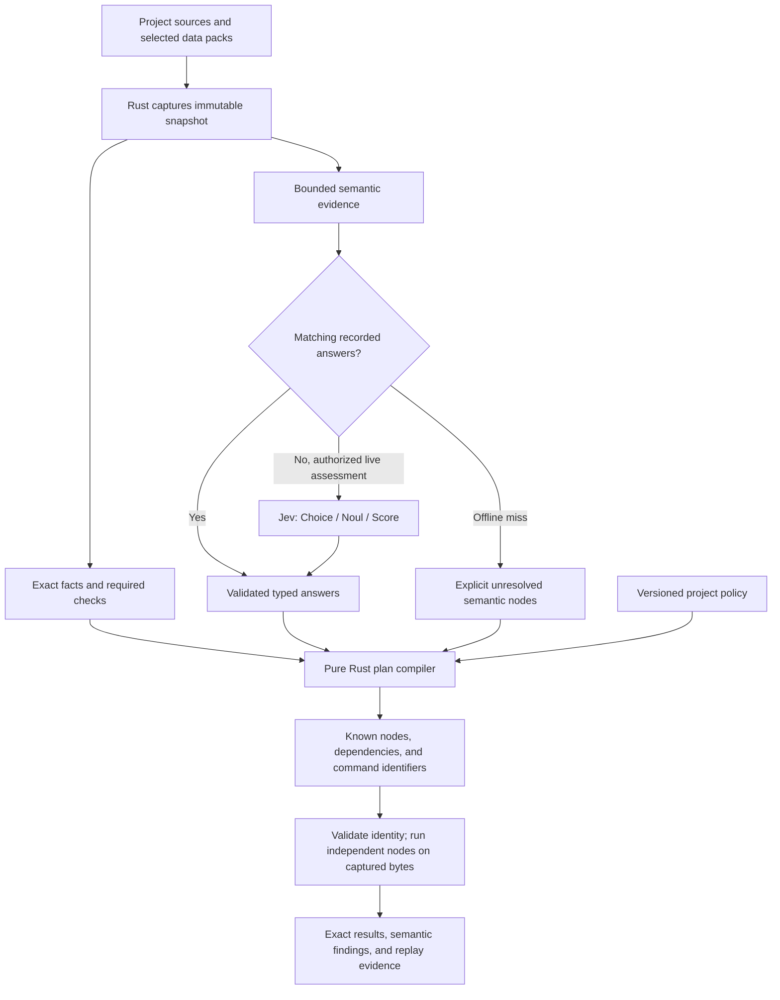

# Orly architecture

Orly does two jobs. It renders one rules file, and it proves the boundary
before a Pull Request (PR) opens. What it stores where is the one thing that
has changed shape since this document was first written — see "Why it's
materialised" below; the gates section after it is unaffected.

## Topology

```text
core/operating-model.md   packs/**   registry.json
                              │
                         bin/orly
                              │
          ┌───────────────────┴───────────────────┐
          │                                       │
   orly update                              orly gate
          │                                       │
   AGENTS.md (repo root)                  reads git + the tree,
          │                               runs the declared commands,
   ~/.claude/CLAUDE.md ─┐                 prints green or red
   ~/.codex/AGENTS.md  ─┼─ symlinks              │
   opencode, amp       ─┘                  exit 0 or 1
```

One generated artifact on this machine: the root `AGENTS.md`. Every agent home
here links to it, so a rule edit is one commit and reaches every session in
this checkout at once — that property is local to Kishore's own machine and
unaffected by anything below.

Every other repository gets its rules a different way: `orly init` materialises
the packs its own sources select — rendered `AGENTS.md`, the rule docs, the gate
scripts, the hooks that run them — into that repository, and writes
`.oracle/orly.json` recording the engine version and every file it wrote,
alongside the repository's own packs, commands, and surfaces. `orly update` re-materialises against the currently installed engine
version; `orly doctor` reports drift between the lock and disk instead of
silently tolerating it. A materialised repository needs no checkout of this
one, on any machine, to read its own rules or run its own gates.

## Why it's materialised

An earlier model (M01) rejected storing per-repository copies: it had cost a
re-baseline commit on every edit, a SHA-256 manifest that invalidated whenever
the tool itself changed, and drift nobody caught — three of four consumer
repositories were stale anyway. The fix at the time was to derive instead of
store: one rendered `AGENTS.md`, symlinked into every agent home, with gate
scripts resolved live from this checkout via `$ORLY_ROOT`.

That traded the storage cost for a distribution cost undiscovered until a
second engineer tried to install the harness without this checkout present —
the symlink and `$ORLY_ROOT` both require a copy of the governance checkout at
a known absolute path, which is exactly what a fresh machine, a Continuous Integration
(CI) runner, or a remote fleet container does not have. `orly init` (M03)
restores storage, but not the failure mode that got it removed: `orly update`
turns a rule change into one command per repository instead of the manual
sync M01 rejected, and the lock makes staleness a reported condition —
`orly doctor` — instead of a silent one. cache-kit.rs is the evidence for both
failure modes in the same repository: its `.oracle/` snapshot from the
pre-thin model sat frozen for four weeks with no update path, and its
generated `AGENTS.md` told a Rust crate its project name was `agentsfleet` —
a persona/product leak M03 also closes, by fencing both behind opt-in packs a
a repository without those sources never selects.

`orly verify --all` still re-renders each pack set twice and compares, then
compares the committed root `AGENTS.md` against a fresh render — that
determinism proof is unchanged by any of this.

## Gates

`orly gate` runs three groups in order and stops at the first red one.

| Gate | Proves |
|---|---|
| `work` | repository configuration and the declared `conform` command over the staged change |
| `verify` | documentation checks and non-test `verify.*` commands; unfinished Sections may be pushed |
| `pr` | exact pushed revision, branch/spec criteria, docs surface, and every declared `verify.*` command |

The authoritative sequence is `dispatch/lifecycle.md`. Full unit, integration,
and memory suites run at the PR boundary. No stored verification cache or
assumption about a custom pre-push hook can remove them. Baselines name an
immutable comparison revision and are measured before the Pull Request.

Every criterion is mechanical — it reads an exit code or a file. Claims that
cannot be proven that way stay prose and are graded by the spec's rubric; they
never become fake criteria.

Four behaviours worth knowing:

- **No spec, no problem — but closing is not escaping.** Spec criteria skip
  with a printed reason, so an ad-hoc bug fix meets the quality gates without
  being told to write a spec. A spec moved to `done/` on the branch is still
  discovered through its `Branch:` header and gates the PR — CHORE(close)
  never skip-passes the criteria it exists to satisfy. Two active specs is an
  error — one stream per worktree.
- **A worktree is its repository.** `repositories.json` registers primary
  checkouts only; a linked worktree resolves through the set of checkouts git
  reports for the shared object store. Streams stay ephemeral and unregistered,
  and the declared commands still run in the worktree, never in the checkout
  that carries the registry entry.
- **Slow suites are conditional.** `verify.integration` and `verify.memory` run
  only when the branch diff carries code files.
- **The docs gate is diff-shaped.** A change under the repository's `surfaces.user`
  prefixes with no matching `surfaces.docs` change is red. Test files and the
  spec tree never count.

## Overrides

`orly override <criterion> --reason <REASON>` writes an empty commit carrying an
`Orly-Override: <criterion> (<reason>)` trailer. It is immutable once pushed,
visible in the PR, scoped to the branch by merge-base, and dead after the merge.
A red criterion with a matching trailer reports `overridden`, never green. A
malformed trailer is not an override; the gate stays red.

## Profiles

`.oracle/orly.json` names any opt-in packs, the command surface, and optionally the diff
surfaces:

```json
{
  "commands": { "conform": [["make", "harness-verify"]],
                "verify.unit": [["make", "test-unit-all"]] },
  "surfaces": { "user": ["src/http/", "cli/src/"],
                "docs": ["docs/"] }
}
```

Orly owns policy and invokes these commands. The repository owns what they do.
Setup requires `conform` and at least one named `verify.*` command.
Documentation repositories can use `verify.docs` for site validation and link
checks without declaring application test suites. `init` reports missing
commands; `doctor` rejects incomplete setup without running those commands.
The final tree check includes the spec, so its evidence must be committed.

## Usage telemetry

Orly keeps usage telemetry off until a person enables anonymous collection in
an interactive run. Hooks, Continuous Integration (CI), and other automated
runs never ask for consent. Off writes no event and makes no network request.

Anonymous events enter a bounded outbound spool under the agentsfleet state
root. After each append, Orly launches a detached sync attempt and lets the
command exit. The sync sends at most 100 events and exits without a fetch when
another attempt ran within five minutes. A successful response removes the
acknowledged prefix. Spool maintenance drops records older than seven days and
keeps the file at or below 10 MiB, so an unavailable destination cannot create
an unbounded local log. Orly runs no telemetry daemon.

PostHog owns product-event storage and funnel analysis. Orly sends no source,
path, repository, branch, argument, output, environment, hostname, username, or
raw error value. A future Insights Fleet may query PostHog with a private key;
the Fleet is an analysis consumer and never the public ingestion boundary.

## Evidence

`orly verify --all --write-evidence` records the source commit and every check
into `.oracle/evidence.json` (git-ignored). Pre-push writes it when the pushed
range touches governance paths.


## M07 target: one native engine with bounded Jev judgments

This section defines the 0.12.0 release. The preceding sections describe
the source-verified 0.10.14 implementation. All five M07 workstreams ship
together in 0.12.0; their specifications track completion and required proof.
Review source revision: `c02f1e02806204811401b01596a04ff4c039d02a`.

### First principles and determinism

One Rust executable owns installation, rule parsing, exact checks, evidence,
rule delivery, coverage mapping, and the authorized Jev client. Markdown remains
readable source data. Selected consumer-language support survives the rewrite.
The target executes no orly-owned TypeScript, Bash, Python, or Go runtime. Repository-native
test/coverage tools remain explicitly declared process boundaries.

Rust owns exact facts and gate status. Jev is TypeSafe's System One model and
supplies narrow typed semantic answers. It cannot grant owner approval, supply
commands or paths, change coverage facts, or override exact checks. Model
answers remain reported in 0.12.0. Missing answers remain incomplete. Fresh
inference may vary; exact recorded validated answers replay reproducibly.
TypeSafe's [API](https://docs.typesafe.ai/api) defines typed answers and
[model guidance](https://docs.typesafe.ai/models) recommends version pinning.
This design pins `jev-1.13.0`; model availability is checked before implementation.

### Executable workstream graph and shared-file boundary

```text
B1  M07_005 foundation + snapshots + interfaces + migration
       ├── B2 M07_002 semantic bank/client/replay/evaluation
       ├── B2 M07_003 coverage parser/producer/run evidence
       └── B2 M07_004 native checks/rules/delivery/evaluators
                      └── B3 M07_001 assembly + journeys + 0.12.0
```

| Workstream | Exclusive implementation scope | Required prerequisite |
|---|---|---|
| M07_005 | Root Cargo/build config, shared types/schemas, core, installer, host loaders, module scaffolds | None |
| M07_002 | `src/judge/`, questions, judge fixtures/tests, judge development runner, docs fragments | Complete B1 interface revision |
| M07_003 | `src/coverage/`, coverage fixtures/tests, docs fragment | Complete B1 interface revision |
| M07_004 | `src/rules/`, `src/checks/`, native evaluators, adapter plans, rule/check fixtures/tests, docs fragments | Complete B1 interface revision |
| M07_001 | Shared routing, final resource assembly, current docs/skills/registry, old executable deletion, workflows, release | Every B2 workstream complete |

B1 retains live old verification during private development; B3 switches configuration and full native audit only after every replacement exists. B1 freezes `EvaluationContext`, `Snapshot`, `CriterionResult`, `CommandInvocation`,
`EvidencePacket`, feature entry points, and all feature configuration/schema fields.
B2 has no shared routing/lockfile/schema edits. A required common change is
reviewed and serialized before affected lanes resume. Static typed modules avoid
a dynamic plugin system. M07_001 registers the features once.

Use one Cargo workspace and one native binary. Independent `orly-fs` and
`orly-decision` libraries own contained file access and typed decision validation.
The root library combines these with execution, installation, and host behavior.
The unpublished development runner lives at `tools/xtask`.
Shared dependency versions and compiler settings live in the workspace manifest.
This follows Microsoft guidelines `M-SMALLER-CRATES` and `M-CARGO-WORKSPACE`.
Cargo owns locked dependency/build resolution.
The initial dependency shape uses standard parsers and Rust-native network
transport; versions and minimum supported compiler are pinned at B1 from the
actual manifests. The binary embeds the sorted rule/question/schema payload.
It needs no package-source directory, JavaScript client, or shell launcher.

The evaluation context accepts a validated configuration wrapper with shared access.
Changing captured configuration requires a new assessment; stale identity checks
refuse execution against different inputs (`src/core/config.rs`, `src/core/execution.rs`).

### Repository review and complete migration map

This table records reviewed families and the chosen realization. B1 expands it
against every tracked path at the comparison revision. That inventory includes
extensionless executables and script bodies generated from TypeScript strings.
No file is considered covered merely because its parent family appears here.

| Current family and source evidence | Target realization |
|---|---|
| `bin/orly:16–26`, `src/*.ts`, `package.json` | Native entry point and modules; remove runtime package/launcher at integration |
| `src/model.ts:49–68`, `src/install.ts`, `src/loaders.ts` | Preserve containment, owned content, and exact preflight/refusal in Rust |
| `src/install.ts:242–261`, `.githooks/pre-commit`, `.githooks/pre-push` | Native executable links; no generated Bash hooks; preserve foreign hooks |
| `dispatch/lib.sh`, `dispatch/write_any.sh`, `write_zig.sh`, `write_ts_adhere_bun.sh`, `write_rust.sh`, `write_sql.sh`, `edit_rules.sh` | Native dispatch/check/rule-routing handlers with existing positive/negative obligations |
| `audits/agents-md.sh`, `data.sh`, `parity-dispatch.sh`, `rule-paths.sh`, `lifecycle-anchors.sh` | Native invariance, expected-label data, path and lifecycle checks |
| `audits/spec-template.sh`, `spec-template.ts`, `doc-read.sh` | Native Markdown validation and separately labeled doc-read evidence |
| `audits/rule-ledger.sh`, `rule-ledger-lib.sh` | Native ledger/census generator; counts are classification/routing, not semantic enforcement |
| `audits/ufs.sh`, `logging.sh`, `msid-ui.sh`, `error-codes.sh`, `rust-error.sh` | Native source checks using selected snapshot and explicit applicability |
| `audits/deinit-pairs.sh`, `sql-mod.sh`, `design-tokens.sh` | Native consumer-language checks; selected pack/config owns roots and vocabularies |
| `evals/dispatch/{coverage,parity,run}.sh`, `evals/test-{agents-md,dispatch-parity}.sh` | Rust positive/negative fixtures and coherence evaluators |
| `evals/install/{cases,release_cases,run}.sh`, `evals/ledger/{doc_read_cases,lib,run}.sh` | Native installation, recovery, delivery, and ledger test harnesses |
| `evals/llms/{agents,fixtures,run}.sh` | Rust fixture parsing; explicit optional coding-agent process boundary; no embedded Python |
| `Makefile:42–57`, `.github/workflows/*` | Existing thin Make aliases plus native development runner; approved workflow rewrite |
| `core/operating-model.md`, `packs/**`, `registry.json` | Authoritative selected rules/map; personal/product lines remain opt-in |
| `dispatch/*.md`, language `packs/**/rules.md`, `AGENTS.md`, `CLAUDE.md` | Preserve source/generated/host roles; regenerate destination after source changes |
| `docs/*.md`, `docs/greptile-learnings/*.md`, `README.md`, `llms.txt`, `skills/*/SKILL.md` | Update active commands and contribution guidance; no deleted script invocation |
| `docs/v1/done/*.md`, archived review records, `SOUL.md`, `SOUL_LOG.md`, data fixtures | Historical/private/data dispositions; no opportunistic historical rewrite or private payload |
| `docs/v1/pending/*.md` | One acyclic executable milestone plan with pending proof metadata |

The old implementation reads staged filenames then working bytes in one audit
(`audits/design-tokens.sh:107–115,130–154`). The target captures an immutable
index snapshot and reads index blobs. Every checker, selected section, judgment
request, coverage result, and evidence packet shares that explicit source identity.
Head and working-tree evaluation are separately named modes.

`SnapshotCapture` owns source selection, captured files, dependencies, and the byte budget. It resolves revisions before reading objects and refuses concurrent index or local-head changes. Event snapshots retain resolved object identities when references move later (`src/core/snapshot_capture.rs`).

### Inspected `agentsfleet` callers and native integration

Read-only caller inspection at `d6130c6dd668072fc42478c6c720c41c40419b29`
traced executable hooks, configuration, Make recipes, workflow jobs, and agent
loaders. Paths in this table are relative to that consumer checkout. This is
source evidence, not a native execution trial. The earlier adaptation snapshot
remains a pinned fixture; implementation must record the revision it actually tests.

| Consumer source evidence | What runs or is declared | Native integration requirement |
|---|---|---|
| `.oracle/orly.json:3,9–41` | Engine pin 0.10.14; conformance, lint, unit, integration, and version commands | Enforce pin/payload identity before evaluation; preserve all five obligations in the migrated profile |
| `.githooks/pre-commit:98–140` | Reject partial staging; assert engine pin; `orly gate work --accept-dirty`; staged secret scan | Preserve project-owned hook; native index checks read captured bytes; a project partial-staging policy remains explicit |
| `make/harness.mk:88–98` | Eight exact audit invocations, including Rust errors, logging, design tokens, and spec shape | Replace orly-managed audit execution with native checks; do not re-enter the outer gate through its own conformance command |
| `.githooks/pre-commit:160–215,241–273` | Surface routing and one parallel Make graph | Encode project routing as data, preserve shared prerequisites and actual command working directories |
| `.githooks/pre-push:66–126,147–165` | Deliberately no orly gate; pushed-range Rust lint and scoped JavaScript tests, serial within their resource class | Offer a pushed-range recipe preserving that cadence; do not replace it with staged-only or full-boundary evaluation |
| `.github/workflows/governance.yml:8–10,31–58` | On Pull Request (PR), install the npm pin, run doctor, then staged conformance through `gate work` | Use verified native assets and explicit event-base/head scope; clean-index checkout must still evaluate changed files |
| `scripts/check_orly_pin.sh:39–108`, `make/quality.mk:101–117` | External pin assertion and its self-tests, also on the lint boundary | Move the assertion into the engine and preserve positive/negative proofs; update caller remedies and current docs |
| `README.md:112–135`, `AGENTS.md:24–45`, `opencode.json:3–5` | Owned hooks require update with `--no-hooks`; agents read committed rules and invoke the final gate | Preserve ownership and loader content, retain explicit no-hook installation; no automatic replacement of foreign hooks |
| `make/quality.mk:48–72`, `make/test-unit.mk:7–25`, `make/test.mk:19` | Rust commands run inside `rustd/`; full unit boundary also includes the live Zig runner | Preserve toolchain selection, feature combinations, and runner tests; root-manifest discovery alone is insufficient |
| `make/test-integration-rustd.mk:25–42,328–343` | Live datastore reset/migration and both Rust test tiers produce `rustd/lcov.info` | Keep these commands outside live judging; use declared isolated resources and fresh report identity, never reset real/shared services for a trial |

The inspected user-surface list omits `rustd/` (`.oracle/orly.json:42–51`).
Prefix-based detection in this engine (`src/surfaces.ts:47–50`) consequently
does not classify a Rust backend source there as a user surface. The migrated
profile must explicitly include active Rust roots and prove a relevant public
change requires documentation. Jev may refine semantic impact; it cannot repair
a missing exact project-root declaration by guessing.

The target supports two hook ownership cases: fresh consumers get native links;
`agentsfleet` keeps its custom hooks until a separately authorized caller change.
`--no-hooks` concerns Git hooks; `--no-agent-hooks` concerns coding-agent adapters.
These controls are independent. Project Make test/build recipes remain declared
consumer commands; removing orly's interpreters does not remove consumer languages.
Command declarations carry working directory, environment key names, declared
outputs, and resource claims. The runner overlaps disjoint resources but serializes
shared JavaScript test resources, Cargo targets, and datastore-reset resources.
Resource values and credentials do not enter model state or public evidence.

Commit scope is the index; push scope is the captured pushed revision range;
remote governance scope is the validated event base/head; the final boundary
runs the complete declared verification set. Native conformance is a builtin
check node, not an external command that recursively invokes the outer gate.
Missing event identity fails instead of producing an empty staged-scope success.

### Results, state, and resource limits

Results have explicit `passed`, `failed`, `skipped`, `reported`, or `overridden`
states and reasons. Original failures survive overrides. Applicable missing
evidence fails exact checks; absent applicability skips. A reproducible result
projection excludes clocks and per-run operational identifiers. Invocation
metadata records durations separately, so evidence need not falsely promise
byte-identical timestamps.

Project commands execute captured source bytes in a private scratch tree, not divergent live working files. Report paths are contained, but arbitrary executables are not claimed to be sandboxed by the runner. The runner invokes argument vectors without a shell, bounds output at 4 MiB
per stream and commands at 300 seconds by default. Owner-declared per-command
deadlines are finite, from 1 to 3,600 seconds, and part of plan identity; Jev
cannot extend them. The runner kills/reaps complete process groups on timeout. Invocation identity deduplicates a shared unit/coverage
command when its requirements agree. Snapshot mutation invalidates run evidence.
Evidence exposes states, codes, counts, paths, and digests rather than raw source,
command output, credentials, environment, or free-text override reasons.

The scheduler uses dependency counters, an ordered ready set, and resource waiters. A waiter blocked by another resource releases its original queue. Tests assert the resulting batch order and count node visits across growing workloads (`src/core/scheduler_graph.rs`, `tests/foundation/scheduling.rs`).

Imported plans validate graph structure and both mandatory safety checks before digest comparison. Compilation validates every supplied decision, including unused answers, before computing identity (`src/core/plan_validate.rs`, `src/core/plan_compile.rs`).

Jev's bounded request policy is specified once in M07_002 §2: 16 KiB state,
24 KiB complete request, 128 pairs per invocation, 16 same-state pairs per batch,
two concurrent requests, three attempts, and 30 seconds total. Strict typed
response validation and complete request identity govern replay. Retention is
30 days/32 MiB for judgments and 30 days/16 MiB for delivery records; eviction
produces a miss or redelivery. These are chosen limits, not measured performance.

### Jev scope and trust

Jev families cover spec preconditions/expected results, assertion relevance,
scope contradiction, single-behavior Dimensions, error-path completeness,
ownership/cleanup, compatibility indirection, documentation claims, architecture
consistency, and extra rule relevance. Each needs a versioned bounded evidence
builder, consumer, clause mapping, and labeled cases. Missing evidence stays
incomplete. Rule additions use only existing candidate identifiers and cannot
remove required sections. Coverage hits never invent per-test attribution.

Live upload needs configured capability, a runtime key, and out-of-tree approval.
The complete request passes engine-owned checks plus native gitleaks scanning.
No repository suppression controls the scan. Scanning reduces disclosure risk;
it cannot certify secrecy. Hooks and exact gates use recorded judgments only
and perform no provider upload. Live judging executes no project commands.

Continuous Integration (CI) separates secretless project execution from the
credential-bearing judge job. The latter consumes only a bounded validated
revision-bound snapshot and trusted released binary; it executes no evaluated
checkout code. Fork runs receive no key. Environment stripping alone is not
process isolation. Source-bearing transport stays restricted to authorized
jobs; public summaries/evidence contain no source. The safe transport proof
is required before enabling optional CI judging.

### Installation and host integration

Managed content and configuration live beneath `.orly/`; repository-owned entry
files preserve custom content. The ignored native engine copy is `.orly/bin/`.
The native configuration's `releases` field selects a contained repository-relative root, defaulting to `.orly/rels/` (`src/core/config.rs`, `src/core/storage.rs`).
Shared documents remain trackable; changing the setting leaves existing files in place (`tests/migration/storage.rs`).
Installation refuses roots overlapping current or prior managed paths, including Git's resolved private directory, before shared-file effects (`src/install/preflight_migration.rs`, `src/core/storage.rs`).
Doctor preserves completed history under the configured root and `docs/v*/done/`; current documents still receive stale-reference checks (`src/install/mod.rs`).
Native `pre-commit`/`pre-push` links route by invocation name. Verify actual Git
execution on the supported platform matrix; do not infer it from compilation.

Migration requires an exclusive installation lock and a retained local operation
manifest. Preflight ownership/symlinks/collisions; atomically install and verify
payload, then switch loaders/hooks/config, then delete only unchanged recorded
old copies. Interrupted retries verify both source and destination identity.
An installation before the first commit records an absent revision. Recovery refuses if the first commit appears before retry (`src/core/git.rs:112`, `src/install/recovery.rs:59`).
Git environment names use host casing rules. Windows also normalizes engine executable casing and the `.exe` suffix before refusing command re-entry (`src/core/git.rs:17`, `src/core/config.rs:45`).
Before any retry writes, `InstallPlanner` rebuilds the pending installation from trusted inputs. The recorded pending operations must match that plan in order. A resealed journal cannot authorize different writes, permissions, hooks, or deletions (`src/install/preflight.rs`).
`Installer` owns the open repository directory. `LocalState` borrows that installer and retains Git and installation-state directories. The lock, planner, and journal share that state.

Directory access uses `cap-std`, identity comparison uses `same-file` handles, and locking uses the standard `File` API. A detected move or replacement refuses further work and preserves recovery state.

The move/retry test moves a linked worktree with Git, reuses its old path, and checks refusal by the stale installer. A new installer completes recovery at the moved location (`tests/migration/ownership.rs`). The recorded binary source must remain available and unchanged.

These checks detect interruptions between actions. Concurrent filesystem changes during a system call remain outside this guarantee.
The product is a single-user command-line tool. Keep these checks local and simple; add concurrency machinery only for a demonstrated need.
Normal commands never maintain an old-layout fallback. Doctor names owned
stale callers; other repositories migrate through their own approved changes.

Every host receives native command and commit-time rule delivery. Pre-edit
adapters require a documented external-command surface and recorded runtime
proof. OpenCode gets command/skill guidance plus commit delivery; the target
installs no TypeScript plugin and promises no unsupported interception.
Emission, self-reported reading, and compliance are separately labeled facts.

### One version and proof boundary

The only public version is 0.12.0, tagged `v0.12.0`, after all workstreams join.
The root Cargo version controls engine/resources/source package/native assets.
Required runnable targets are both macOS architectures, both Linux musl
architectures, and `x86_64-pc-windows-msvc`, as named in M07_001. Indy selected
Windows, Linux, and macOS support on Oct 01, 2026. Platform support requires
actual execution evidence; compilation alone does not establish it.
The approved tests-only `native-foundation.yml` workflow runs the foundation on
Windows, Linux, and macOS with Rust 1.98.1. Release automation stays in M07_001.
The release ships embedded rules/questions/schemas, license, checksums, and a
build manifest. It needs Git and declared native tools, without an orly runtime
interpreter. Native startup/check benchmarks and actual target journeys are
release evidence, not inferred efficiency from the language choice.

Jev ships as a built-in capability while upload remains opt-in. M07_002 requires
frozen labeled evaluation, independent comparison, repeated live calls, and
explicit per-family quality thresholds before release. Offline tests do not
substitute for provider evidence. M07_001 requires combined fresh/migration
journeys, all exact obligations, current docs, and complete native distribution.
Workflow, harness, and publishing approvals remain action-triggered; rewriting
these pending specs does not authorize those later mutations.


### Adaptable decision runtime: Choice, Noul, and Score

The user clarified that copying the current process is not the target. A project
selects recipes and data packs; numbered specs and the current private lifecycle
are optional conventions. The common runtime is immutable facts → typed Jev
decisions → pure Rust plan composition → bounded native execution → evidence.
Existing gate verbs are recipe entry points into this runtime.



Ordinary hooks use recorded answers only. An offline miss preserves the exact
core and reports unresolved semantic branches; live assessment is an explicit,
bounded operation. Choice selects known options, Noul tests independent
conditions, and Score orders known candidates. The compiler cannot turn model
text into an executable command or remove a required exact check.

Choice selects among declared handling recipes or scope outcomes, with no-match
and insufficient-evidence outcomes. Noul supplies independent semantic conditions,
such as security impact or public behavior change; uncertainty is not medium
severity. Score ranks candidate rule relevance and explicit assertion strength
against ordered levels. All three have real consumers. Rust validates raw values,
preserves uncertainty, and composes only known identifiers. Preferences may use
weighted ranking; mandatory security conditions never average away.

Independent questions sharing state are batched, including speculative branches.
Another provider call occurs only when a prior answer requires new evidence.
Inspect the [primitive guide](https://docs.typesafe.ai/primitives) and
[confidence routing](https://docs.typesafe.ai/patterns/confidence-routing).
Bounded options remove generated-prose interpretation; fresh answers can vary.
Versioned exact replay plus a pure reducer fixes the resulting plan for the
same evidence, raw answers, policy, and engine identity.

Data-only versioned packs declare questions, built-in evidence selectors, rule
sections, known candidates, calibrated thresholds, and policy composition.
They cannot contain executable snippets or arbitrary expressions. Rust traits
extend exact check/build capabilities through reviewed engine changes. Validate
pack versions, namespaced identities, capability references, graph cycles, and
all source/policy/engine digests before running a plan. A policy change can reuse
raw judgments without new inference; a meaning/evidence/model change cannot.

Missing optional judgments leave semantic branches unresolved/reported. The
independent exact core still runs without credentials or replay; missing required
deterministic inputs fail their nodes. A consumed unresolved recipe branch stays
blocked instead of becoming a guessed choice. Structural graph faults reject
execution; model incompleteness alone never changes an exact gate verdict.

### Required adaptation trials

The same release must work in three distinct project profiles: the inspected
`agentsfleet` mixed Rust/TypeScript/Zig/shell repository, a small Rust command-line
project, and a TypeScript library. Read-only inspection pinned the first at
`e5a6964797dd2b841988d5ddbc730834947c5374`. Its Rust root is `rustd/Cargo.toml`,
the command-line interface (CLI) manifest is `cli/package.json`, and Zig uses `build.zig`; root-only
manifest sniffing is insufficient. The other projects are self-contained fixtures.

Trials use scratch copies and scoped allowlisted commands, without editing the
real sibling checkout or using its credentials. Each profile adds a domain
question/rule, changes thresholds using retained answers, and moves a source
root without engine edits. Test positive/quiet/uncertain/missing/conflicting/
injected/offline/stale-plan cases, at least 12 labeled scenarios per profile,
and a live mixed-primitive assessment plus replay for each. Record setup work,
decisions, plan digests, command results, unavailable builders, latency, and
token use. M07_001's trial report and release gate require all three proofs.
Zig/shell input support remains; no orly-owned shell execution is retained.
